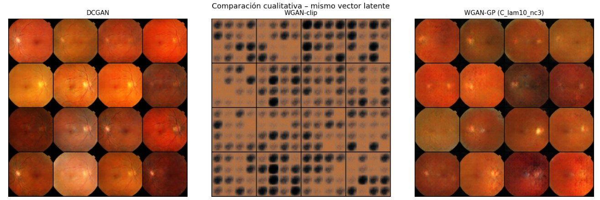
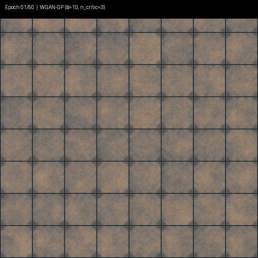

# 🔬 Generación de imágenes sintéticas de fondo de ojo mediante WGAN-GP para mejorar la disponibilidad de datos en el diagnóstico de retinopatía diabética

> Síntesis de imágenes retinales para mejorar la disponibilidad de datos en el diagnóstico de retinopatía diabética.

**Maestría en Ciencias Cognitivas — Facultades de Ciencias, Ingeniería y Psicología | UdelaR | Mauro Carlevaro**


---

## 📋 Descripción

La escasez de imágenes médicas etiquetadas es una de las principales limitaciones para el desarrollo de sistemas de diagnóstico asistido por computadora. Este proyecto aborda dicha limitación mediante modelos generativos adversariales (GANs) entrenados sobre el dataset **Messidor-2** (1.744 imágenes de fondo de ojo).

Se implementan y comparan tres arquitecturas bajo condiciones controladas con generador compartido:

| Modelo | Descripción |
|--------|-------------|
| **DCGAN** | Baseline convolucional con pérdida BCE |
| **WGAN-clip** | Wasserstein GAN con weight clipping (2 variantes) |
| **WGAN-GP** | Wasserstein GAN con gradient penalty — modelo propuesto (4 configuraciones) |

**Corrección clave:** sustitución de `BatchNorm2d` → `InstanceNorm2d` en el crítico de WGAN-GP, que redujo el FID de 138.14 a 87.06 (**mejora de 51 puntos**).

---

## 🖼️ Comparación cualitativa — mismo vector latente



> Las tres grillas fueron generadas con el **mismo vector latente fijo**, por lo que las diferencias se atribuyen exclusivamente al esquema de entrenamiento y la función de pérdida. WGAN-clip colapsa en patrones no anatómicos. DCGAN y WGAN-GP conservan morfología retinal reconocible.

---

## 🎬 Evolución del entrenamiento — WGAN-GP (C: λ=10, n_critic=3)



> Mismo vector latente fijo en todas las épocas. Época 1: ruido puro sin estructura anatómica. Época 50: retinas con morfología reconocible, disco óptico visible y diversidad de color.

---

## 📊 Resultados

| Modelo | FID ↓ | Var. píxeles ↑ | Dist. inter-img ↑ |
|--------|-------|----------------|-------------------|
| DCGAN (baseline) | **47.40** | 0.013054 | 31.54 |
| WGAN-clip (lr=5e-5, clip=0.01) | 353.62 | 0.009537 | 30.05 |
| WGAN-GP B (λ=10, nc=5) | 90.46 | 0.010664 | 28.82 |
| **WGAN-GP C (λ=10, nc=3)** ⭐ | **87.06** | 0.009515 | 27.66 |
| WGAN-GP D (λ=5, nc=5) | 90.71 | 0.012721 | 31.92 |
| WGAN-GP E (λ=5, nc=3) | 94.08 | 0.012156 | 31.31 |

> ⭐ Configuración óptima: `lambda_gp=10`, `n_critic=3`, `InstanceNorm2d`

**Hallazgos principales:**
- WGAN-clip colapsa desde la época 5 con pérdidas congeladas
- `BatchNorm` → `InstanceNorm` en el crítico redujo FID en 51 puntos
- `lambda_gp=10` estabiliza mejor el entrenamiento que `lambda_gp=5`
- `n_critic=3` genera mejor equilibrio adversarial en datasets pequeños
- Con config C se generó un **dataset sintético de 2.000 imágenes**

---

## 🗂️ Estructura del repositorio

```
wgan-gp-retina/
├── README.md
├── comparison.png                # Comparación cualitativa modelos
├── wgan_gp_evolution.gif         # Evolución del entrenamiento época a época
├── LICENSE
├── wgan_gp_retinopatia.py        # Script principal
├── wgan_gp_retinopatia.ipynb     # Notebook Google Colab
└── informe_final.pdf             # Paper IEEE completo
```

---

## ⚙️ Requisitos

```
torch
torchvision
numpy
pandas
matplotlib
scikit-learn
Pillow
tqdm
```

```bash
pip install torch torchvision numpy pandas matplotlib scikit-learn Pillow tqdm
```

---

## 🚀 Cómo correr el código

### Opción A — Google Colab (recomendado)

1. Abrir `wgan_gp_retinopatia.ipynb` en Google Colab
2. Activar GPU: `Entorno de ejecución → Cambiar tipo de entorno → T4 GPU`
3. Montar Google Drive y ajustar la ruta del dataset en el código:
```python
BASE_PATH = "/content/drive/My Drive/tu_carpeta/Messidor-2"
IMG_DIR   = os.path.join(BASE_PATH, "preprocess")
CSV_PATH  = os.path.join(BASE_PATH, "messidor_data.csv")
```
4. Ejecutar todas las celdas en orden

### Opción B — Local

```bash
git clone https://github.com/tu-usuario/wgan-gp-retina.git
cd wgan-gp-retina
pip install -r requirements.txt
python wgan_gp_retinopatia.py
```

---

## 🔧 Configuración de hiperparámetros

### Parámetros comunes
```python
IMG_SIZE     = 128   # resolución final de las imágenes
BATCH_SIZE   = 8
EPOCHS_DCGAN = 50
EPOCHS_WGAN  = 50    # WGAN-GP y WGAN-clip (originalmente 100, reducido por limitaciones computacionales)
NZ           = 100   # dimensión del vector latente (ruido de entrada al generador)
NGF          = 64    # filtros base generador — va REDUCIENDO filtros a medida que aumenta la resolución espacial
NDF          = 64    # filtros base discriminador/crítico — va AUMENTANDO filtros a medida que reduce la resolución espacial
NC           = 3     # canales de salida del generador (RGB)
SEED         = 42    # semilla para reproducibilidad
```

### DCGAN
```python
OPTIMIZER  = Adam(beta1=0.5, beta2=0.999)
LR         = 2e-4    # misma lr para generador y discriminador
NORM       = BatchNorm2d
```

### WGAN-GP (config óptima C)
```python
OPTIMIZER  = Adam(beta1=0, beta2=0.9)
LR         = 1e-4
LAMBDA_GP  = 10
N_CRITIC   = 3
NORM       = InstanceNorm2d  # crítico — NO usar BatchNorm
```

### WGAN-clip
```python
OPTIMIZER    = RMSprop
LR           = 5e-5   # variante 2: 1e-4
CLIP_VALUE   = 0.01   # variante 2: 0.05
N_CRITIC     = 5
```

> ⚠️ **Importante:** No usar `BatchNorm2d` en el crítico de WGAN-GP. Introduce dependencias entre muestras que corrompen el gradient penalty. Usar `InstanceNorm2d(affine=True)`.

---

## 🏗️ Arquitecturas

El generador es **compartido** entre los tres modelos. Solo difieren el discriminador/crítico y la función de pérdida.

**Generador** (ConvTranspose2d + BatchNorm + ReLU):
```
z(100) → 512 → 256 → 128 → 64 → 32 → 3 canales (128×128) → Tanh
```

**Discriminador DCGAN** (Conv2d + BatchNorm + LeakyReLU):
```
3 canales → 64 → 128 → 256 → 512 → 1024 → 1 escalar → Sigmoid
```

**Crítico WGAN-GP** (Conv2d + InstanceNorm + LeakyReLU):
```
3 canales → 64 → 128 → 256 → 512 → 1024 → 1 escalar (sin Sigmoid)
```

---

## 📁 Dataset

**Messidor-2** — dataset clínicamente validado de imágenes de fondo de ojo.
- 1.744 imágenes RGB
- Etiquetadas por grado de retinopatía diabética (0–4)
- Distribución desbalanceada (predomina grado 0)
- Partición: 80% entrenamiento / 20% validación (estratificada, `SEED=42`)

Disponible en: https://www.adcis.net/en/third-party/messidor2/

Preprocesamiento aplicado:
```python
transforms.Resize(150)           # resize conservando aspecto
transforms.CenterCrop(128)       # crop central a 128×128
transforms.Normalize([0.5]*3, [0.5]*3)  # rango [-1, 1]
```

---

## 📈 Métricas de evaluación

- **FID** — similitud entre distribuciones real y sintética (512 muestras, InceptionV3)
- **Varianza promedio de píxeles** — detecta mode collapse (≈0 indica imágenes casi idénticas)
- **Distancia promedio inter-imagen** — diversidad entre pares de imágenes generadas

---

## 🤖 Uso de IA

En el desarrollo de este trabajo se utilizaron asistentes de IA como ChatGPT, Claude y Gemini como herramientas de apoyo en tareas de depuración, ampliación de búsqueda bibliográfica, testing, refactorización de código y como corrector de redacción. Todas las decisiones metodológicas, experimentos, implementaciones y conclusiones son responsabilidad del autor.

---

## 📚 Referencias

[1] I. Goodfellow, J. Pouget-Abadie, M. Mirza, B. Xu, D. Warde-Farley, S. Ozair, A. Courville, and Y. Bengio, “Generative adversarial nets,” in Advances in Neural Information Processing Systems, vol. 27, 2014.

[2] A. Radford, L. Metz, and S. Chintala, “Unsupervised representation learning with deep convolutional generative adversarial networks,” in Proc. International Conference on Learning Representations (ICLR), 2016.

[3] M. Arjovsky, S. Chintala, and L. Bottou, “Wasserstein generative adversarial networks,” in Proc. International Conference on Machine Learning (ICML), 2017.

[4] I. Gulrajani, F. Ahmed, M. Arjovsky, V. Dumoulin, and A. Courville, “Improved training of Wasserstein GANs,” in Advances in Neural Information Processing Systems, vol. 30, 2017.

[5] M. Arjovsky and L. Bottou, “Towards principled methods for training generative adversarial networks,” arXiv:1701.04862, 2017.

[6] T. Salimans, I. Goodfellow, W. Zaremba, V. Cheung, A. Radford, and X. Chen, “Improved techniques for training GANs,” in Advances in Neural Information Processing Systems, vol. 29, 2016.

[7] E. Decenciere et al., “Feedback on a publicly distributed image database: The Messidor database,” Image Analysis & Stereology, vol. 33, no. 3, pp. 231–234, 2014

[8] M. Heusel, H. Ramsauer, T. Unterthiner, B. Nessler, and S. Hochreiter, “GANs trained by a two time-scale update rule converge to a local Nash equilibrium,” in Advances in Neural Information Processing Systems, vol. 30, 2017.

---

## 📄 Licencia

Apache License 2.0 — libre uso con atribución. Ver [LICENSE](LICENSE) para más detalles.
